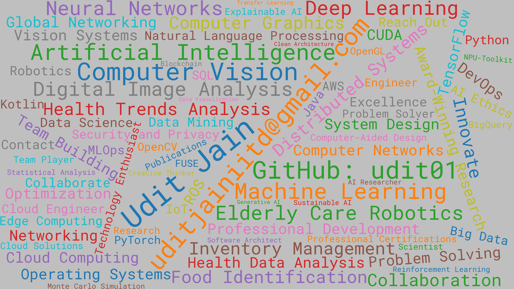

  
  <h1>Udit Jain</h1>
  
<strong>Computer Vision Engineer & AI Specialist</strong>

  
  
  

## 👋 About Me

I'm a Computer Vision Engineer at Samsung Research specializing in AI model development for next-generation smart appliances. With experience spanning Samsung Research, Harvard University, Kyutech Institute of Technology, and Indian Institute of Technology. I combine deep technical expertise with a passion for creating practical AI solutions that enhance everyday experiences.

- 🔭 Currently working on vision-based AI models for Samsung's Smart Refrigerators
- 🌱 Specializing in on-device AI optimization, NPU deployment, and computer vision
- 🌍 Based in Seoul, South Korea
- 💼 Professional focus on edge AI, model optimization, and real-time computer vision systems

## 🛠️ Technical Expertise

### AI & Computer Vision
- Deep Learning: TensorFlow, PyTorch, Keras
- Computer Vision: OpenCV, object detection, segmentation
- Model Optimization: TensorFlow Lite, quantization, NPU deployment
- Natural Language Processing: SpaCy, NLTK, KlonPY

### Cloud & Data Engineering
- AWS: S3, EMR, Glue, Athena, IAM
- Big Data: Spark, Hadoop, PySpark
- Data Visualization: Apache Superset, Matplotlib

### Software Development
- Languages: Python, Java, Kotlin, C/C++
- Mobile: Android SDK, Jetpack Compose
- Architecture: Clean Architecture, MVVM

## 🏆 Featured Projects

### [Samsung Digital Appliances AI](https://udit01.github.io/tabs/projects.html)
Developed vision-based AI models for Samsung's next-gen smart refrigerators, enabling real-time food recognition and inventory management. Optimized for on-device deployment with <40MB size, <70ms latency, and >90% accuracy.

### [Samsung Health Research Platform](https://news.samsung.com/global/samsung-electronics-unveils-samsung-health-research-stack)
Architected and deployed a comprehensive health research application connecting Samsung devices with medical research institutions. Implemented using Kotlin, Android Framework, and Node.js with Clean Architecture principles.

### [Unbinding Bodies Art Exhibition](https://www.hwia.kim/unbinding-bodies)
Designed end-to-end Computer Vision software for an interactive art exhibition, creating systems that track visitors' faces and control robot arm movements in real-time.

### [Global Sleep Health Study](https://news.samsung.com/global/understanding-sleep-how-our-sleeping-habits-changed-over-the-pandemic)
Led data analysis on Samsung Health's 200M+ user database, revealing critical insights into global sleep patterns during the COVID-19 pandemic. Featured in international media and scientific publications.

## 🌐 International Experience

- **Samsung Research** - Seoul, South Korea (2020-Present)
- **Harvard University, Visual Computing Group** - Massachusetts, USA (Remote, 2020)
- **Kyutech Institute of Technology, Shibata Labs** - Fukuoka, Japan (2018)

## 📫 Let's Connect

I'm always open to discussing AI research, computer vision projects, or potential collaborations. Feel free to reach out through [LinkedIn](https://www.linkedin.com/in/uditjain01/) or visit my [portfolio website](https://udit01.github.io) to learn more about my work.

## 🔍 Current Focus

I'm currently exploring advanced techniques in:
- Real-time object detection and segmentation for edge devices
- Neural Processing Unit (NPU) optimization strategies
- Out-of-distribution detection for robust AI systems
- Computer vision applications in interactive art and installations

 

 

[website]: http://udit01.github.io
<!-- [course]: http://vsCodeHero.com -->
<!-- [twitter]: https://twitter.com/codeSTACKr -->
[youtube]: https://www.youtube.com/channel/UC2umyIiPGNbK7qRQRFvi8KQ
<!-- [instagram]: https://instagram.com/codeSTACKr -->
[linkedin]: https://www.linkedin.com/in/uditjainiitd/
[email]: mailto:uditjainiitd@gmail.com

